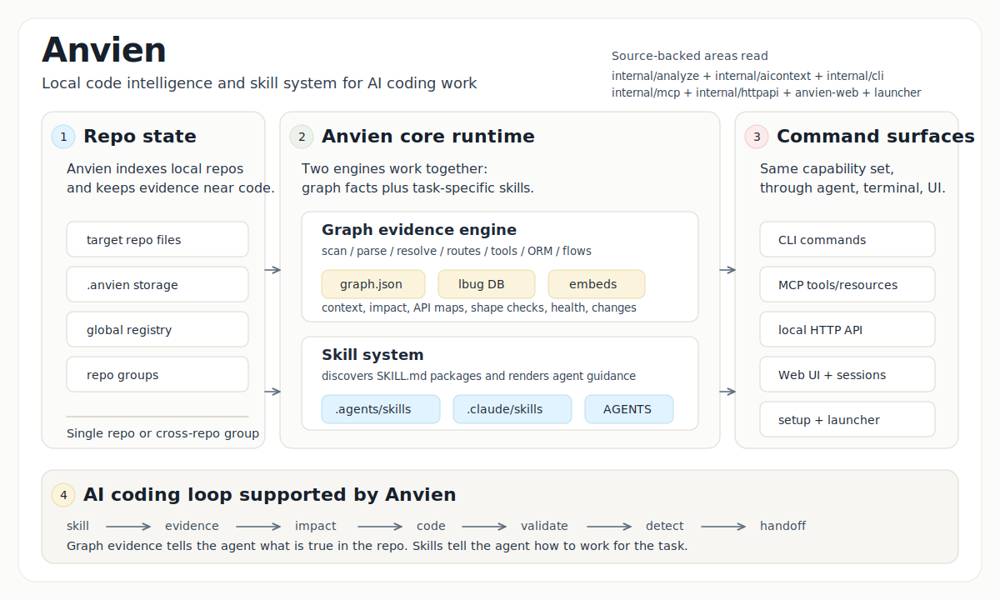

# Anvien (version: `1.2.6`)

> ## (2 in 1 tool) — Intelligence Graph Knowledge Map + Skill-Kit for AI.

---

## Why Use Anvien?

<p align="center">
  
</p>

> Anvien builds one of the fastest and most accurate code intelligence graphs for large repositories.

> When you vibe code with AI, the context window is always limited. The longer a session runs, the easier it is for the agent to lose track of information it already read, trace the same code again, or misunderstand how files, functions, and modules relate to each other.

> Anvien solves this by building a connected map of your codebase: which files relate to which files, which functions call each other, and which modules belong to each execution flow. This helps AI agents understand the project structure faster, navigate relationships across the codebase, and spend less time rediscovering context.

---

## Important notice: *Anvien has no official cryptocurrency, token, or coin. Any token/coin using the Anvien name is not affiliated with, endorsed by, or created by this project or its maintainers.*

Anvien indexes a local codebase into a knowledge graph, then exposes that graph to AI coding agents, CLI commands, and a local Web UI.

The core product is still local code intelligence:

- `anvien analyze` builds a repo-local graph index in `<repo>/.anvien/`.
- the graph stores semantic layers such as App Layer, Functional Area, source-site proof metadata, ResolutionGap entities, and Resolution Health summaries.
- file-centric projection views expose file summaries, symbol trees, derived file relationships, unresolved source-site groups, linked flows/routes/tools/tests, and quality signals without replacing the symbol graph.
- `anvien mcp` exposes indexed repos to MCP clients such as Claude Code, Codex, Cursor, and OpenCode.
- `anvien serve` exposes the same local runtime over HTTP for the browser UI.
- `anvien-launcher/` packages the local backend and Web UI for a Windows `AnvienLauncher.exe` flow.

`anvien analyze` now also prints causal file classification counts, including files handled by dedicated analyzer phases, plus `fileProjection` status, file inventory, dependency edges, unresolved-file count, and top file hotspots. The file commands below use that projection; the symbol graph remains canonical.

No Anvien-hosted cloud service is involved in the active local runtime path.

You do not need to put API keys into Anvien. Indexing, graph storage, repo switching, and graph queries run locally on your machine. For chat, Anvien uses the local Codex or Claude Code session/account you already use on this machine; Anvien does not store provider keys or route chat through an Anvien cloud service.

---

## Current Runtime Model

| Surface | Purpose | Entry point |
|---------|---------|-------------|
| CLI | Analyze repos, query the graph, inspect impact, manage indexes/groups | `anvien ...` |
| MCP stdio | Agent-facing graph tools and resources | `anvien mcp` |
| Local HTTP API | Web UI backend, graph streaming, analyze jobs, session bridge | `anvien serve` |
| Web UI | Browser graph explorer, repo picker/analyze UI, Codex/Claude Code style session chat | `anvien-web/` or packaged launcher |
| Windows launcher | Starts packaged Web UI and backend on `127.0.0.1` | `anvien-launcher\AnvienLauncher.exe` |

The Web UI is a frontend over the local HTTP backend. Repo switching and graph loading use explicit repo-scoped read targets; they do not depend on one mutable process-global active repo.

The Web chat does not run an AI model inside Anvien. The shared session contract supports `codex` and `claude-code`; the current backend mounts the Codex CLI adapter. Anvien keeps repo binding, streaming, cancellation, and UI state local.

---

  ## How to use Anvien

  Requires Node.js 20+, npm, and Go.

  1. Clone or download the Anvien repository.

  2. Open Codex CLI or Claude Code in the Anvien repository folder.

  3. Paste this prompt:

     ```text
     Install Anvien from this repository and configure its MCP integration.
     ```


     Then run:

     ```
     powershell -ExecutionPolicy Bypass -File anvien-launcher\build.ps1
     ```

  4. Use anvien-launcher\AnvienLauncher.exe to open the visual Web UI.
  5. After Anvien MCP is configured, your AI agent can use Anvien tools
     for codebase analysis, impact checks, graph queries, and navigation.

  The agent should build the Go-backed anvien package, install or link the
  local CLI, run anvien setup, and verify anvien --version.

### Manual install

```bash
git clone https://github.com/tamnguyendinh/Anvien.git
cd Anvien

cd anvien
npm install
npm link

anvien --version
```

Index a local repository:

```bash
cd /path/to/your/repo
anvien analyze .
```

This creates `<repo>/.anvien/` and registers the repo in `~/.anvien/registry.json`.

Configure MCP/editor integration:

```bash
anvien setup
```

Manual MCP examples:

```bash
claude mcp add anvien -- anvien mcp
codex mcp add anvien -- anvien mcp
```

Codex TOML:

```toml
[mcp_servers.anvien]
command = "anvien"
args = ["mcp"]
```

### Full build: 

Full build means run the whole command sequence below from the repository root.

```powershell
cd .\anvien
npm install
npm run build
npm install -g .
Get-Command anvien
anvien version
cd ..
powershell -ExecutionPolicy Bypass -File .\anvien-launcher\build.ps1
anvien version
anvien analyze . --force
```

or run script: scripts\full-build.ps1

### Grok (xAI)

This repository provides a **Grok-only** MCP configuration at `.grok/config.toml`.

When you open the Anvien folder with Grok, the Anvien tools are automatically available (this file has higher priority than `.mcp.json` and does not affect Claude, Cursor, Codex, or other agents).

**For contributors working inside this repo:**

- Start Grok (recommended: `grok --model grok-build --effort high` or `xhigh`)
- The MCP server will be started via `go run ./cmd/anvien mcp`
- Verify with `/mcps` or `grok mcp list`

**For other projects or daily use:**

Build once and register with an explicit path:

```bash
go build -o anvien-stable.exe ./cmd/anvien
grok mcp add anvien -- "E:\\path\\to\\anvien-stable.exe" mcp
```

You can also create a `.grok/config.toml` in any of your own repositories to enable Anvien tools there.

This approach keeps the public MCP contract (used by all other agents) completely unchanged.

---

## Quick Start: Web UI

Development flow:

```bash
# terminal 1, from the repo root
go run ./cmd/anvien serve --host 127.0.0.1 --port 4848

# terminal 2, from the repo root
cd anvien-web
npm install
npm run dev
```

Open:

```text
http://127.0.0.1:5228
```

The browser connects to:

```text
http://127.0.0.1:4848
```

From the Web UI you can:

- choose an indexed local repo
- analyze another local repo
- remove a repo from the landing list
- switch repos from the header dropdown
- browse graph nodes, links, files, processes, and search results
- open File Map to sort/filter files by unresolved sites, fan-in, fan-out, symbols, flows, tests, changed status, API scope, and file kind
- click a file to inspect File Detail: summary, quality signals, symbol tree, local/inbound/outbound relationship groups, unresolved source-site samples, linked flows/routes/MCP tools/tests, and source preview
- use the local session bridge for Codex/Claude Code style chat

---

## Packaged Windows Launcher

The packaged launcher is a convenience layer around the same local backend and Web UI.

Build it:

```powershell
powershell -ExecutionPolicy Bypass -File anvien-launcher\build.ps1
```

Important artifacts:

```text
anvien-launcher\AnvienLauncher.exe
anvien\bin\anvien.exe
anvien-launcher\server-bundle\anvien-server.exe
anvien-launcher\web-dist\
```

Runtime behavior:

- `AnvienLauncher.exe` is rebuilt by `anvien-launcher\build.ps1` and is the packaged user entrypoint.
- `anvien\bin\anvien.exe` is the single production Anvien CLI/runtime executable built by the full build.
- `AnvienLauncher.exe` serves the packaged Web UI on `127.0.0.1:5228` and opens the in-app start screen.
- `anvien-server.exe` starts `anvien\bin\anvien.exe serve`.
- backend health is checked at `http://127.0.0.1:4848/api/info`.
- reset/stop use the launcher state file plus process path sweep for the packaged runtime.

The launcher must remain optional. `anvien serve` is still the direct backend entry point.

---

## Main CLI Commands

```bash
anvien setup                     # Configure local MCP/editor access
anvien analyze [path]            # Full local repo analysis
anvien analyze --force           # Force full re-index
anvien analyze --embeddings      # Generate semantic embeddings
anvien analyze --no-stats        # Omit volatile stats from generated agent files
anvien analyze --skip-git        # Analyze a folder without requiring .git
anvien analyze --name <alias>    # Register repo under a custom name
anvien index [path...]           # Register an existing local index
anvien list                      # List indexed repos
anvien status                    # Show index status for current repo
anvien clean                     # Delete current repo index
anvien clean --all --force       # Delete all indexes
anvien mcp                       # Start MCP server over stdio
anvien serve                     # Start local HTTP backend on 127.0.0.1:4848
anvien doctor                    # Inspect local runtime locks and processes
anvien version                   # Print version/build information
anvien wiki                      # Show wiki capability status
anvien wiki-mode [off|local]     # Show or set local wiki capability mode
anvien completion <shell>        # Generate shell completion script
```

Analyze output separates code parsing from indexed non-code inputs:

```text
files: scanned=<n> parsed_code=<n> failed=<n>
indexed: documents=<n> metadata=<n> analyzers=<n> scripts=<n> static=<n>
gaps: unsupported_language=<n> unknown=<n>
```

`unsupported_language` is reserved for recognized code-like inputs with no ScopeIR extractor or dedicated analyzer phase. Documents, configs, reports, fixtures, COBOL/JCL analyzer inputs, scripts, and static assets are counted in their own buckets.

Direct graph tools:

```bash
anvien query <search_query>            # Search across graph lanes
anvien query files <search_query>      # Search files first, with matched symbols and file summaries
anvien query symbols <search_query>    # Search symbols first, with containing file summaries
anvien query flows <search_query>      # Search execution flows
anvien query api <search_query>        # Search API routes and MCP tools
anvien context [name]                  # Smart symbol/file context
anvien context file <path>             # Force File Detail context for one file
anvien context symbol <symbol>         # Force symbol context
anvien impact [target]                 # Smart blast-radius analysis
anvien impact file <path>              # Aggregate blast radius from symbols in one file
anvien impact symbol <symbol>          # Symbol blast radius with file-layer evidence
anvien impact route <route>            # Route handler/consumer impact
anvien impact tool <tool>              # MCP tool definition/flow impact
anvien rename <symbol> <newName>       # Graph-assisted symbol rename
anvien cypher <query>                  # Run an ad hoc graph query
anvien detect-changes                  # Map git diffs to graph changes
anvien detect-changes files            # Group changed/affected evidence by file
anvien detect-changes symbols          # Group changed/affected evidence by symbol
anvien detect-changes flows            # Group changed/affected evidence by flow
anvien augment <pattern>               # Add graph context to a text search pattern
anvien file-detail <path>              # File detail, summary, symbol tree, relationships, unresolved sites, linked flows/tests
anvien file-hotspots                   # List file hotspots by unresolved, fan-in, fan-out, symbols, flows, or tests
anvien api route-map [route]           # Route handler/consumer map
anvien api tool-map [tool]             # MCP tool definition/handler map
anvien api shape-check [route]         # API shape drift check
anvien api impact [route]              # API route impact report
anvien graph-health                    # Graph topology and diagnostic health
anvien graph-health files              # File-level graph-health rows; use file-hotspots for file filters
anvien query-health                    # Query retrieval health
anvien resolution-inventory            # ResolutionGap inventory
anvien source-site-accuracy            # Source-site proof accuracy
anvien benchmark-compare <before> <after> # Compare analyze benchmark outputs
```

AI context and skills:

```bash
anvien analyze                   # Regenerate AGENTS.md/CLAUDE.md and repo skills
anvien analyze --no-stats        # Accepted compatibility no-op; generated context has no volatile counts
anvien setup                     # Install MCP/editor config and generated skills
```

`anvien analyze` writes a managed Anvien section into `AGENTS.md` and `CLAUDE.md`. That section keeps command selection and skill selection separate:

- `Command Selection Guide` maps tasks directly to Anvien CLI/MCP commands such as `query`, `context`, `impact`, `detect-changes`, API commands, graph-health commands, runtime commands, and group commands.
- `Skill Selection Guide` points only to retained workflow skills when the task needs a domain workflow.

Generated Anvien workflow skill examples include direct package roots:

- `.agents/skills/api-surface/SKILL.md` / `.claude/skills/api-surface/SKILL.md`
- `.agents/skills/refactoring/SKILL.md` / `.claude/skills/refactoring/SKILL.md`
- `.agents/skills/debugging/SKILL.md` / `.claude/skills/debugging/SKILL.md`
- `.agents/skills/planner/SKILL.md` / `.claude/skills/planner/SKILL.md`
- `.agents/skills/qa/SKILL.md` / `.claude/skills/qa/SKILL.md`

Concrete command execution should still come from the generated `Command Selection Guide`; skills guide API-surface work, refactoring, debugging, QA, and `docs/plans` plan/evidence/benchmark work.

Semantic graph diagnostics:

```bash
anvien graph-health summary --repo <repo> --json                  # Graph health summary
anvien graph-health report --repo <repo> --limit 20 --json        # Triage candidates
anvien graph-health components --repo <repo> --json               # Component summaries
anvien graph-health files --repo <repo> --limit 20 --json         # File health rows; use file-hotspots for --kind/app-layer filters
anvien query-health --repo <repo> --out .tmp/query-health.json     # Query retrieval health
anvien resolution-inventory --graph .anvien/graph.json --out .tmp/resolution-inventory.json # ResolutionGap inventory
anvien source-site-accuracy --graph .anvien/graph.json --out .tmp/source-site-accuracy.json # Source-site accuracy
```

Repository groups:

```bash
anvien group create <name>                         # Create a repo group
anvien group add <group> <groupPath> <registryName> # Add an indexed repo to a group
anvien group remove <group> <path>                 # Remove a repo from a group
anvien group list [name]                           # List groups or inspect one group
anvien group sync <name>                           # Build the group contract registry
anvien group contracts <name>                      # Inspect group contracts and cross-links
anvien group query <name> <query>                  # Search execution flows across the group
anvien group status <name>                         # Check group repo staleness
```

Repo-local settings live in `.anvien/settings.json`; `maxExecutionFlows` caps execution-flow materialization during `analyze`. `ANVIEN_MAX_PROCESSES` is a temporary override.

---

## MCP Tools And Resources

MCP tools mirror the CLI graph workflows:

```text
list_repos         # Discover indexed repos
query              # Search graph lanes, including file rows
cypher             # Raw graph query
context            # Symbol/file context
detect_changes     # Git-diff impact
rename             # Graph-assisted rename
impact             # Blast radius
route_map          # API route map
tool_map           # MCP/RPC tool map
shape_check        # API shape drift
api_impact         # API route impact
group_list         # List repo groups
group_sync         # Sync group contracts
group_contracts    # Inspect group contracts
group_query        # Search across a group
group_status       # Check group staleness
```

Common resources:

```text
anvien://repos                  # Indexed repos
anvien://setup                  # Setup/onboarding content
anvien://repo/{name}/context    # Repo overview and stats
anvien://repo/{name}/clusters   # Functional clusters
anvien://repo/{name}/cluster/{name} # Cluster detail
anvien://repo/{name}/processes  # Execution flows
anvien://repo/{name}/process/{name} # Process trace
anvien://repo/{name}/schema     # Graph schema
```

MCP prompts:

| Prompt | Purpose |
|--------|---------|
| `detect_impact` | Agent template for pre-commit impact analysis with `detect_changes`, `context`, `impact`, freshness checks, and HIGH/CRITICAL blast-radius interpretation |
| `generate_map` | Agent template for evidence-backed architecture documentation from `anvien://repos`, repo context, clusters, processes, selected process details, and any extra tools/commands the agent actually reads |

MCP prompts are workflow templates for MCP-capable agents, not CLI commands. `generate_map` must resolve an exact repo before reading repo resources, URL-escape repo and process names in resource URIs, refresh stale graph evidence with `anvien analyze --force` when required, and avoid architecture claims or Mermaid edges that are not backed by graph evidence the agent actually read.

When only one repo is indexed, most repo-scoped tool calls can omit `repo`. With multiple indexed repos, pass the repo name or path explicitly.

---

## How Indexing Works

`anvien analyze` runs a full local pipeline:

```text
scan -> structure -> [markdown, cobol] -> parse -> [routes, tools, orm]
  -> crossFile -> mro -> communities -> processes
  -> semantic enrichment -> LadybugDB load -> FTS
  -> file projection -> optional embeddings -> metadata/registry/agent files
```

The graph is stored in LadybugDB under `<repo>/.anvien/`.

The file projection is built from the canonical graph after analyze. It derives file summaries, symbol trees, local/inbound/outbound relationship groups, unresolved source-site groups, linked flows/routes/tools/tests, and file quality signals from symbol and source-site facts.

Semantic enrichment adds user-facing graph meaning on top of raw code symbols:

- **App Layer**: backend, frontend, API, shared contract, docs, tests, config, generated contract, mixed, or unknown.
- **Functional Area**: high-confidence ownership such as resolution, graph health, query, MCP, Web graph UI, layout, contracts, providers, runtime, analyzer, session, launcher, CLI, storage, or unknown.
- **Source-site proof**: resolved relationships keep source-site IDs, proof kind, target role, target text, file/range, confidence, and resolution source.
- **ResolutionGap**: unresolved, external, ambiguous, unsupported, or non-actionable references are persisted as diagnostic graph entities instead of being silently dropped or converted into fake resolved edges.
- **Resolution Health**: graph readers can separate resolved references, in-repo analyzer gaps, external unresolved references, non-actionable builtins/standard-library/test-framework references, and unclassified unknowns.

In the Web UI, ResolutionGap entities are diagnostic nodes rather than real code symbols. They are rendered as small square nodes and can be filtered or grouped separately from normal symbol nodes.

Storage:

```text
<repo>/.anvien/
  lbug
  lbug.wal
  lbug.lock
  graph.json
  meta.json
  settings.json

~/.anvien/
  registry.json
```

Supported language detection currently covers:

```text
JavaScript, TypeScript, Python, Java, C, C++, C#, Go, Ruby, Rust,
PHP, Kotlin, Swift, Dart, Vue, Svelte, Astro, COBOL
```

Document detection covers Markdown, PDF, Word, and spreadsheet files.

COBOL/JCL is handled through the dedicated COBOL phase rather than the normal tree-sitter worker path.

---

## Local HTTP API

`anvien serve` exposes the local backend used by the Web UI:

| Endpoint | Purpose |
|----------|---------|
| `/api/info` | Finite backend liveness/readiness |
| `/api/heartbeat` | Long-lived SSE heartbeat stream |
| `/api/repos`, `/api/repo` | List/select/remove indexed repos |
| `/api/graph` | Repo-scoped graph load/stream |
| `/api/query`, `/api/search`, `/api/file`, `/api/grep` | Repo-scoped read/search helpers |
| `/api/file-detail`, `/api/file-hotspots` | File-centric projection detail and hotspot/list data |
| `/api/process*`, `/api/cluster*` | Derived graph views |
| `/api/local/folder-picker` | Native local folder picker bridge |
| `/api/analyze`, `/api/embed` | Background analyze/embed jobs |
| `/api/mcp` | MCP-over-HTTP bridge |
| `/api/session/*` | Session bridge for chat runtime |

The graph loading path uses:

```text
repo-resolver -> repo-read-executor -> graph-read-service -> graph-stream-http
```

Repo selection stays explicit through this path, so Web graph reads do not depend on process-global active-repo state.

---

## Docker

Docker support remains available as an advanced deployment path. It is separate from the primary local CLI/launcher flow.

Files:

- `Dockerfile.cli`
- `Dockerfile.web`
- `docker-compose.yaml`
- `.env.example`

Compose expects exact image tags:

```bash
cp .env.example .env
# set SERVER_IMAGE and WEB_IMAGE
docker compose --env-file .env up -d
```

Default ports:

```text
server: http://127.0.0.1:4848
web:    http://127.0.0.1:4173
```

To make host repos visible to the container, set `WORKSPACE_DIR` to a local folder that contains the repos you want to analyze. It is mounted read-only at `/workspace`.

---

## Repository Layout

| Path | Role |
|------|------|
| `cmd/`, `internal/` | Go CLI, MCP server, HTTP API, ingestion, LadybugDB, embeddings, contracts, session/runtime code |
| `anvien/` | npm packaging and Go runtime distribution glue |
| `anvien-web/` | React/Vite Web UI and local runtime client |
| `contracts/web-ui/` | Go-generated Web UI contract manifest |
| `anvien-launcher/` | Windows launcher, server wrapper, packaged Web UI/backend assets |
| `.claude/`, `anvien-claude-plugin/` | Generated agent context output and plugin metadata |
| `docs/plans/` | Implementation plans and investigation records |
| `.github/` | CI workflows |

See [ARCHITECTURE.md](ARCHITECTURE.md) for the detailed system map.

---

## Development

Build core packages:

```bash
cd anvien
npm install
npm run build
```

Build Web UI:

```bash
go run ./cmd/generate-web-contracts --check

cd anvien-web
npm install
npm run build
```

Build full Windows launcher package:

```powershell
powershell -ExecutionPolicy Bypass -File anvien-launcher\build.ps1
```

Useful docs:

- [ARCHITECTURE.md](ARCHITECTURE.md)
- [CHANGELOG.md](CHANGELOG.md)
- [RUNBOOK.md](RUNBOOK.md)
- [GUARDRAILS.md](GUARDRAILS.md)
- [CONTRIBUTING.md](CONTRIBUTING.md)
- [TESTING.md](TESTING.md)

---

## Security And Privacy

- Index data is stored locally in `<repo>/.anvien/`.
- The global registry is local under `~/.anvien/`.
- The Web UI talks to the local backend at `127.0.0.1:4848`.
- Anvien does not store AI provider API keys in the browser.
- Anvien does not route chat through an Anvien cloud service.
- Codex/Claude Code style chat depends on the local session/provider already available on the machine.

---

## Acknowledgments

- [Model Context Protocol](https://modelcontextprotocol.io/)
- [Tree-sitter](https://tree-sitter.github.io/)
- [LadybugDB](https://ladybugdb.com/)
- [Sigma.js](https://www.sigmajs.org/)
- [Graphology](https://graphology.github.io/)
- [Transformers.js](https://huggingface.co/docs/transformers.js)
